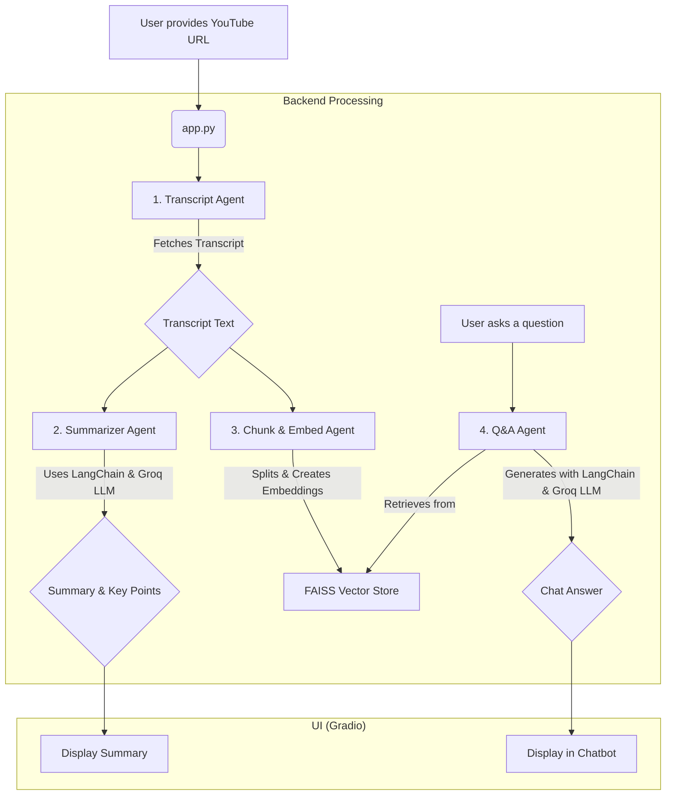

# 🎥 YouTube AI Companion

A powerful tool that leverages Large Language Models (LLMs) to provide concise summaries and enable interactive Q&A for any YouTube video with a transcript. This application is built with Python, LangChain, Groq, and Gradio.


---

## ✨ Features

-   **Load Any YouTube Video**: Simply provide a YouTube URL to begin.
-   **AI-Powered Summarization**: Get a concise, well-structured summary of the entire video transcript.
-   **Key Takeaways**: Automatically extracts the 3-5 most important points as a bulleted list.
-   **Interactive Q&A Chat**: Ask questions directly about the video's content and get answers based *only* on the provided transcript, powered by a Retrieval-Augmented Generation (RAG) pipeline.

---

## 🏗️ How It Works (Architecture)

The application is built using a modular, agent-based architecture. Each agent is responsible for a specific task, and the main Gradio app orchestrates them.



1.  **Transcript Agent (`transcript_agent.py`)**: Uses the `youtube-transcript-api` to fetch the full transcript of the video.
2.  **Summarizer Agent (`summarizer_agent.py`)**: Employs LangChain's `load_summarize_chain` (using the `refine` strategy to manage API rate limits) and the Groq API to generate a summary and a list of key takeaways.
3.  **Chunk & Embed Agent (`chunk_embed_agent.py`)**: Splits the transcript into manageable chunks, generates vector embeddings for each chunk using a Hugging Face model (`BAAI/bge-base-en-v1.5`), and stores them in a FAISS in-memory vector store.
4.  **Q&A Agent (`qa_agent.py`)**: Powers the chat functionality. It uses LangChain's `ConversationalRetrievalChain` to find the most relevant transcript chunks from the FAISS store and feeds them to the LLM to generate an accurate, context-aware answer.
5.  **Application (`app.py`)**: The main Gradio interface that integrates all the agents and provides a user-friendly web UI.

---

## 🛠️ Technology Stack

-   **Backend**: Python
-   **AI Orchestration**: LangChain
-   **LLM Provider**: [Groq](https://groq.com/) (inference for Llama 3 70B)
-   **Web UI**: Gradio
-   **Embeddings**: Hugging Face (`BAAI/bge-base-en-v1.5`)
-   **Vector Store**: FAISS (CPU)
-   **Transcript Fetching**: `youtube-transcript-api`

---

## 🚀 Setup and Installation

Follow these steps to get the project running on your local machine.

### 1. Clone the Repository

```bash
git clone https://github.com/your-username/youtube-agent.git
cd youtube-agent
```

### 2. Create a `requirements.txt` File

If you haven't already, create a `requirements.txt` file from your active virtual environment:
```bash
pip freeze > requirements.txt
```

### 3. Create and Activate a Virtual Environment

It is highly recommended to use a virtual environment to manage dependencies.

**Windows:**
```bash
python -m venv venv
.\venv\Scripts\activate
```

**macOS / Linux:**
```bash
python3 -m venv venv
source venv/bin/activate
```

### 4. Install Dependencies

Install all the required Python packages from the `requirements.txt` file.

```bash
pip install -r requirements.txt
```

### 5. Configure Environment Variables

You need to provide your Groq API key for the application to work.

a. Rename the example environment file:
```bash
# Windows
rename .env.example .env

# macOS / Linux
mv .env.example .env
```

b. Open the newly created `.env` file and add your Groq API key:
```
GROQ_API_KEY="your_api_key_here"
```
You can get a free API key from the [Groq Console](https://console.groq.com/keys).

---

## ▶️ How to Run the Application

Once the setup is complete, you can run the application with a single command:

```bash
python app.py
```

This will start the Gradio web server. Open your web browser and navigate to the local URL displayed in the terminal (usually `http://127.0.0.1:7860`). You can now start analyzing YouTube videos!